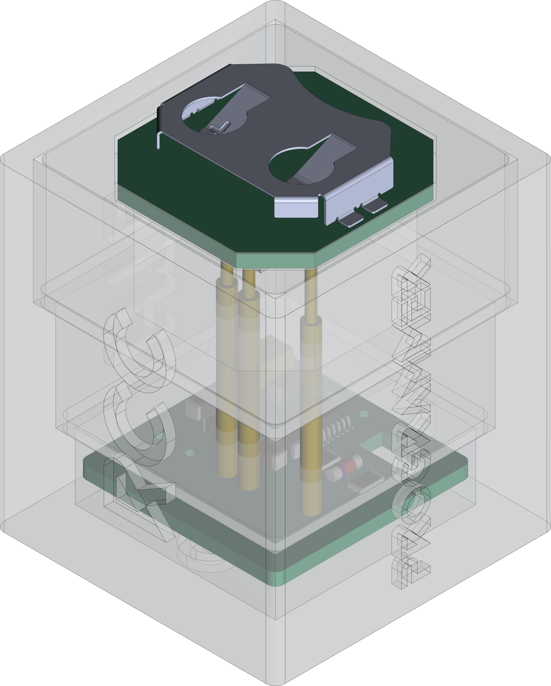
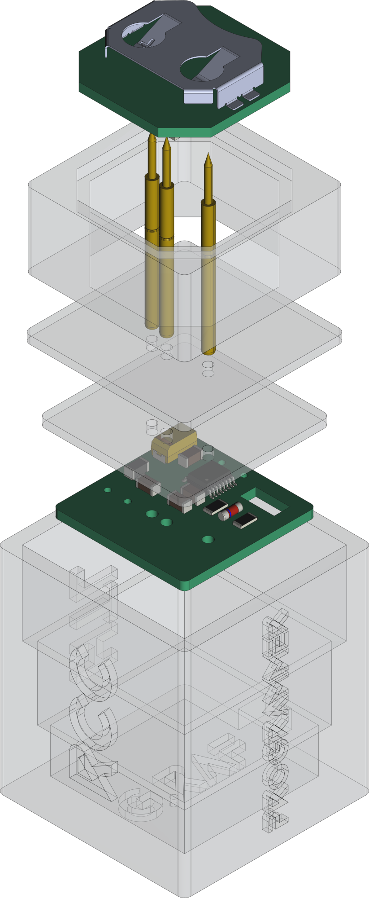

[](https://github.com/0x007e/rcc_programmer) [](https://creativecommons.org/licenses/by-nc-sa/4.0/legalcode) [](https://www.gnu.org/licenses/gpl-3.0.html)  

# `RCC_programmer` - RCC (UPDI) Programmer

The `RCC_programmer` project is based on a pcb with an [FT230XS](#additional-information) to program the [RCC](https://github.com/0x0007e/rcc) (RGB LED Color Cube). It either can be programmed with the developed module or with a simple self-made [UPDI](#additional-information) converter. The deliverd software writes the defined settings with `avr-dude` over `serialupdi` onto the [ATTiny402](#additional-information).

| Experience | Level |
|:------------|:-----:|
| Soldering   |  |
| Mechanical  |  |
| Software    |  |

# Downloads

| Type      | File               | Description              |
|:---------:|:------------------:|:-------------------------|
| Schematic | [pdf](https://github.com/0x007E/rcc_programmer/releases/latest/download/schematic.pdf) / [cadlab](https://cadlab.io/project/29709/main/files) | Schematic files |
| Board | [pdf](https://github.com/0x007E/rcc_programmer/releases/latest/download/pcb.pdf) / [cadlab](https://cadlab.io/project/29709/main/files) | Board file |
| Drill | [pdf](https://github.com/0x007E/rcc_programmer/releases/latest/download/drill.pdf) | Drill file |
| PCB | [zip](https://github.com/0x007E/rcc_programmer/releases/latest/download/kicad.zip) / [tar](https://github.com/0x007E/rcc_programmer/releases/latest/download/kicad.tar.gz) | KiCAD/Gerber/BoM/Drill files |
| Mechanical | [zip](https://github.com/0x007E/rcc_programmer/releases/latest/download/freecad.zip) / [tar](https://github.com/0x007E/rcc_programmer/releases/latest/download/freecad.tar.gz) | FreeCAD/Housing and PCB (STEP) files     |
| Software | [exe](https://0x007e.github.io/rcc_programmer/clickonce/setup.exe) | Programming software for RCC |

# Hardware

There are two parts of the hardware. The pcb and the housing of the `RCC_programmer`. The pcb is created with [KiCAD](#additional-information) and the housing with [FreeCAD](#additional-information) . The software is programmed with [Visual Studio](#additional-information). All files are built with `github actions` so that they are ready for a production environment. The housing is printed with a 3D-printer (`Dremel 3D40`) and the software is build as ClickOnce application that can be installed over a simple setup file and keeps automatically up-to-date.

## PCB

The circuit board is populated on one side (Top). The best way for soldering the `SMD` components is within a vapor phase soldering system.

### Top Layer


### Bottom Layer


## Mechanical

The housing has a tolerance of `0.2mm` on each side of the case. So the pcb should fit perfectly in the housing. The tolerance can be modified with `FreeCAD` in the `Parameter` Spreadsheet.

### Assembled



### Exploded



# Programming/Setup

The `RCC_programmer` is powerd over USB with `5V` and uses the internal `3V3` converter of the `FT230XS` as main programming voltage. The programming software itself uses avr-dude in background and a simple [UPDI](#additional-information) circuit to program the `RCC`. It can be programmed over [UPDI](#additional-information) on `TP1`. The firmware for the cube can be downloaded in the [download section](#downloads).

``` bash
#               RCC                     RCC_programmer (Adapter)
#                                     +-------------------------+      +---------------------+
#                                     |          TXD     U  +---+---+  |                     |
#     +---------------------+         |     U     +      S  |  USB  |--+ +-----------------+ |
#     |                     |         |     P    +++     B  +---+---+  | | RCC Programmer  | |
#     |    RCC - Color Cube |         |     D    / \     /      |      | | ~~~~~~~~        | |
#     |                  +--+--+   +--+--+  I    +++     U      |      | | ~~~~~           | |
#     |              VCC | TP3 +---+ VCC |        |      A      |      | | ~~~~~~~~~~~~    | |
#     |              GND | TP2 +---+ GND |  B    +++     R      |      | |                 | |
#     |                  +--+--+   +--+--+  R    | |     T      |      | +-----------------+ |
#     |                     |         |     I    | |            |      |                     |
#     |                  +--+--+   +--+--+  D    +++   +------+ |      | Computer            |
#     |             UPDI | TP1 +---+ PDI +--G-----+    | 3V3  | |      |                     |
#     |                  +--+--+   +--+--+  E    RXD   +------+ |      +---------------------+
#     +---------------------+         +-------------------------+
#
```

# Software

The software loads avr-dude and the current firmware of the `RCC` from predefined repositories in `appsettings.json`. By clicking onto the LEDs the color of each LED can be defined. With the intensity trackbar the brightness of the LEDs can be adjusted. To program the `RCC` the correct selection of the serial port is necessary. By hitting the program button the `RCC` gets programmed over `serialupdi` with `avr-dude` (if the programmer is connected correctly with the `RCC`).

> IMPORTANT: The battery should not be mounted during programming. There will be a short circuit between the internal `3V3` of the `FT230XS` and the battery!!!


# Additional Information

| Type          | Link                                                                 | Description                     |
|:-------------:|:--------------------------------------------------------------------:|:--------------------------------|
| ATtiny402     | [pdf](https://ww1.microchip.com/downloads/en/DeviceDoc/ATtiny202-402-AVR-MCU-with-Core-Independent-Peripherals_and-picoPower-40001969A.pdf) | ATtiny microcontroller |
| FT230XS       | [pdf](https://ftdichip.com/wp-content/uploads/2021/10/DS_FT230X.pdf) | FT230XS Datasheet               |
| UPDI          | [web](https://github.com/0x007e/updi)                                | UPDI-Adapter with AVR-Dude      |
| Visual Studio | [web](https://visualstudio.microsoft.com/)                           | Download page for Visual Studio |
| KiCAD         | [web](https://www.kicad.org/)                                        | KiCAD project page              |
| FreeCAD       | [web](https://www.freecad.org/)                                      | FreeCAD project page            |

---

R. GAECHTER
